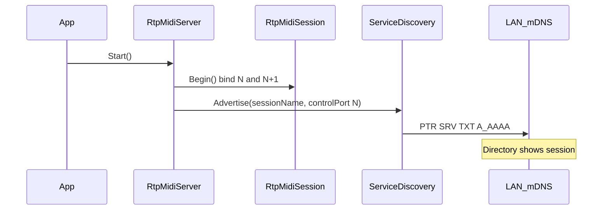
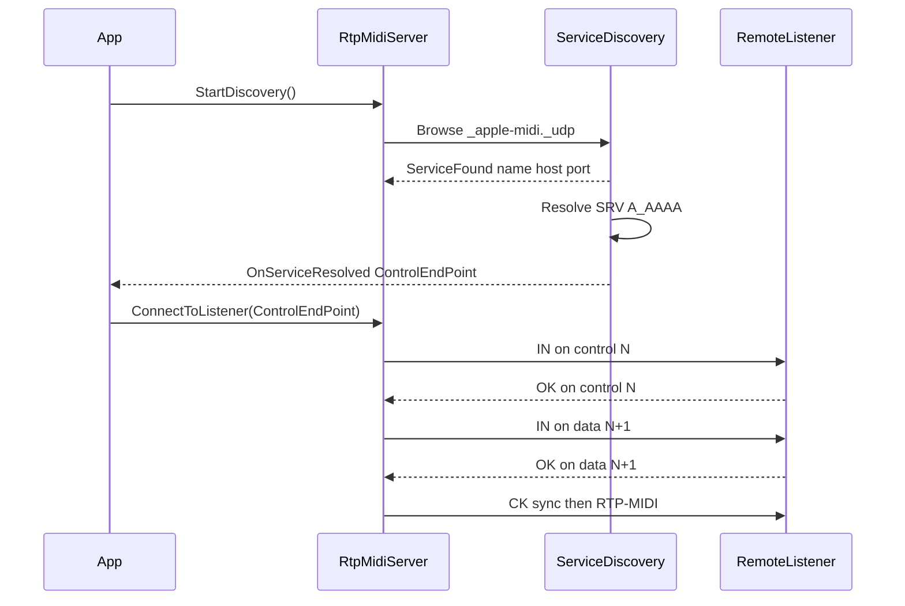

# RTP-MIDI Zeroconf（DNS-SD / mDNS）広告・発見 — 開発計画書

| 項目 | 内容 |
|------|------|
| 対象リポジトリ | RTP-MIDI-for-.NET（`jp.kshoji.rtpmidi`） |
| 作成日 | 2026-09-12 |
| 改訂 | 2026-09-15 — Phase 1 完了（定数・抽象・Fake・ユニットテスト）。2026-09-14 — Phase 0 完了（Vendor 同梱・THIRD-PARTY・Advertise プロトタイプ）。2026-09-13 — mDNS 実装を Unity-MIDI-Plugin の Makaretu.Dns（net-mdns / net-dns）に固定 |
| 目的 | Apple Network MIDI / Tobias rtpMIDI / 主要 OSS と互換する Zeroconf 広告・発見の仕様を定義し、実装フェーズを定める |
| 本ドキュメントの範囲 | 仕様検討・API 設計・モジュール分割・実装フェーズ・テスト計画（コード実装は別フェーズ） |
| mDNS 実装（確定） | [net-mdns 0.27.0](https://github.com/richardschneider/net-mdns) + [net-dns 2.0.1](https://github.com/richardschneider/net-dns)（`Makaretu.Dns`）。Unity-MIDI-Plugin の Network MIDI 2.0 発見と同系統 |

---

## 1. 背景・目的

### 1.1 現状

本ライブラリは AppleMIDI セッション制御（`IN` / `OK` / `NO` / `BY` / `CK` / `RS`）と RTP-MIDI 転送までを実装済みである。接続は **手動の IP + 制御ポート** のみ。

```cs
// Listener: 制御 N / データ N+1 で待受
var server = new RtpMidiServer("My session name", 5004, connectionListener, eventHandler);
server.Start();

// Initiator: 相手を直指定
server.ConnectToListener(new IPEndPoint(IPAddress.Parse("192.168.0.100"), 5004));
```

関連クラス:

| クラス | ファイル | 役割 |
|--------|----------|------|
| `RtpMidiServer` | `Runtime/RtpMidiServer.cs` | 公開 API、`Start` / `Stop` / `ConnectToListener` |
| `RtpMidiSession` | `Runtime/RtpMidiSession.cs` | UDP 制御/データ、招待状態機械 |
| `RtpMidiConstants` 等 | `Runtime/RtpMidiProtocol.cs` | AppleMIDI 定数・メッセージ型 |

Bonjour / Zeroconf / mDNS / DNS-SD / `_apple-midi` に関する実装・依存・ドキュメント言及は現状ない。

### 1.2 目的

1. 自セッションを LAN 上に **広告（Advertise）** し、macOS Audio MIDI Setup・Tobias Erichsen rtpMIDI・rtpmidid 等の Directory に表示する。
2. 他ホストの `_apple-midi._udp` サービスを **発見（Browse / Resolve）** し、既存の招待フローに接続する。
3. 発見レイヤとセッションレイヤを分離し、手動 `ConnectToListener(IPEndPoint)` は維持する（KissBox 等の非 Bonjour 機器との互換）。

### 1.3 非目的（本計画の対象外）

- Network MIDI 2.0（サービス型 `_midi2._udp`、必須 TXT キーあり）— 別プロトコル
- RTP-MIDI Journaling の完全実装（既存ライブラリ方針どおり）
- Docker / コンテナ向け mDNS ブリッジの製品化
- OS ネイティブ Bonjour/Avahi API の第一実装（将来差し替え用インターフェースのみ先に定義）

---

## 2. 参考実装比較

実務上の「Network MIDI / rtpMIDI」発見は RFC 6295（RTP-MIDI ペイロード）の一部ではなく、Apple のセッション制御（AppleMIDI）と DNS-SD サービス型 `_apple-midi._udp` がデファクト標準である。

### 2.1 比較表

| 実装 | サービス型 | 広告ポート | TXT | 備考 |
|------|------------|------------|-----|------|
| Apple MIDI Network Driver | `_apple-midi._udp` | 制御ポートのみ | キー未定義 | 任意の連続ポートペア。公式ドキュメント |
| rtpmidid | `_apple-midi._udp` | 制御（既定 5004） | Avahi `NULL`（空） | 衝突時 ` #N`。自ホストは `OUR_OWN` で除外 |
| midimonster | `_apple-midi._udp.local.` | 制御 | **空 TXT RR を明示** | 「Apple が要求」コメント。自前 mDNS |
| raveloxmidi | `_apple-midi._udp` | 制御（既定 5004） | サンプル由来の独自キーあり | `service.ipv6=no` 既定。IPv6 誤解決の実例あり |
| Tobias rtpMIDI (Windows) | `_apple-midi._udp` | 制御 | （規格どおり） | Bonjour 要。Local name / Bonjour name 分離可。手動 Directory あり |
| KissBox | `_apple-midi._udp`（V3+） | V3 は制御 **常に 5004** | — | Bonjour は **オプション**。V1/V2 は手動 IP |
| Arduino-AppleMIDI / ESP | アプリ側で `apple-midi` / `udp` | 制御 | — | ライブラリ本体は mDNS 非同梱 |
| **本リポジトリ（現状）** | なし | — | — | セッション層のみ |

### 2.2 主要出典

- [Apple MIDI Network Driver Protocol](https://developer.apple.com/library/archive/documentation/Audio/Conceptual/MIDINetworkDriverProtocol/MIDI/MIDI.html) — `_apple-midi._udp`、制御 N / データ N+1、招待手順
- [dns-sd.org Service Types — apple-midi](https://www.dns-sd.org/servicetypes.html) — Defined TXT keys: **None**
- [rtpmidid `mdns_rtpmidi.cpp`](https://github.com/davidmoreno/rtpmidid/blob/master/lib/mdns_rtpmidi.cpp)
- [midimonster `backends/rtpmidi`](https://github.com/cbdevnet/midimonster/blob/master/backends/rtpmidi.h)
- [KissBox RTP-MIDI Integration guide](https://kiss-box.com/wp-content/uploads/2017/03/RTP-MIDI-Integration-guide-for-Windows-and-MacOS.pdf)
- [Tobias Erichsen rtpMIDI tutorial](https://www.tobias-erichsen.de/software/rtpmidi/rtpmidi-tutorial.html)
- [MIDI.org Network MIDI 2.0 overview](https://midi.org/network-midi-2-0-udp-overview) — `_midi2` との差異（混同防止）

### 2.3 本ライブラリへの示唆

1. サービス型は必ず `_apple-midi._udp`（`_rtpmidi` 等は Audio MIDI Setup に出ない）。
2. SRV に載せるのは **制御ポートのみ**。データは `制御 + 1`。
3. TXT キーは独自定義しない。空 TXT RR を付ける。
4. Bonjour は必須ではない — 手動接続 API を残す。
5. IPv6 を listen していないなら AAAA を広告しない（raveloxmidi / Mac の既知問題）。

---

## 3. 仕様定義

### 3.1 DNS-SD レコード

リンクローカル（`local.`）での標準セット:

| レコード | 内容 | 例 |
|----------|------|----|
| PTR | `_apple-midi._udp.local.` → サービスインスタンス | `My session._apple-midi._udp.local.` |
| SRV | 優先度 / 重み / **制御ポート** / ターゲットホスト | `0 0 5004 hostname.local.` |
| TXT | キーなし（長さ 0 の TXT RR） | （空） |
| A / AAAA | ホスト名のアドレス。**実際に listen しているスタックのみ** | |

定数案（`RtpMidiProtocol.cs` または discovery 用定数クラス）:

```text
ServiceType     = "_apple-midi._udp"
ServiceDomain   = "local."
```

### 3.2 ポート規約

```text
DNS-SD SRV.port  = ControlPort (N)
DataPort         = N + 1   （広告しない・規約で導出）
```

本ライブラリの `RtpMidiSession` は既に `listenPort` = 制御、`listenPort + 1` = データで一致している。

慣習例: 5004/5005。必須ではない。同一ホスト上の複数セッションは 5004, 5006, … のように制御ポートをずらす。

### 3.3 命名

| 名前 | 役割 | 本ライブラリでの対応 |
|------|------|----------------------|
| DNS-SD サービスインスタンス名 | Directory に出る表示名 | 既定はコンストラクタの `sessionName` |
| mDNS ホスト名 | SRV ターゲット。A/AAAA 解決 | 実装ライブラリ／OS の既定ホスト名 |
| AppleMIDI `name`（`IN`/`OK` 内） | セッション確立後の相手表示名 | `localName` と一致させるのが一般的 |

名前衝突時は mDNS 実装が ` #2` 等で改名し得る。改名後の名前をアプリに通知できると望ましい。

### 3.4 IPv4 / IPv6

| 方針 | 理由 |
|------|------|
| 既定は IPv4 を優先して広告・解決 | Unity / モバイル / 一部デスクトップでの dual-stack 事故を避ける |
| AAAA はデータソケットが IPv6 で listen している場合のみ | IPv6 だけ解決されて接続失敗するケースへの対策 |
| Link-local IPv6 はスコープ ID が必要 | 手動入力より Resolve 経路を推奨 |

### 3.5 自ホスト除外

Browse 結果に自分の広告が含まれる場合、二重接続を避ける。

判定候補（実装時に組み合わせ）:

1. サービスインスタンス名 + 制御ポートが自セッションと一致
2. 解決 IP が自ホストのアドレス集合に含まれる
3. mDNS 実装が提供する「own」フラグ（rtpmidid / Avahi 相当）があれば利用

### 3.6 発見結果の正規化

発見レイヤがアプリ／`RtpMidiServer` に渡す最小情報:

| フィールド | 型（概念） | 必須 |
|------------|------------|------|
| `ServiceName` | string | はい |
| `HostName` | string | はい |
| `ControlEndPoint` | IPEndPoint（制御ポート） | はい |
| `ResolvedAddresses` | IPAddress[] | 任意（デバッグ用） |

接続時は `ControlEndPoint` を既存 `ConnectToListener` に渡す。データポートはセッション層が `port + 1` で導出する。

---

## 4. シーケンス

### 4.1 広告（Listener 側）



### 4.2 発見 → 招待（Initiator 側）



### 4.3 停止

`Stop()` で UDP を閉じると同時に Advertise を撤回（goodbye / unpublish）する。`StopDiscovery()` で Browse を停止する。広告と発見は独立に ON/OFF 可能とする。

---

## 5. API 設計案

公開入口は引き続き `RtpMidiServer`。発見結果の通知は接続完了（`IRtpMidiDeviceConnectionListener`）とは別レイヤとする。

### 5.1 発見イベント

```cs
namespace jp.kshoji.rtpmidi
{
    public sealed class RtpMidiDiscoveredService
    {
        public string ServiceName { get; }
        public string HostName { get; }
        public IPEndPoint ControlEndPoint { get; }
    }

    public interface IRtpMidiServiceDiscoveryListener
    {
        void OnServiceAppeared(RtpMidiDiscoveredService service);
        void OnServiceDisappeared(string serviceName);
    }
}
```

### 5.2 Zeroconf 抽象（差し替え可能）

```cs
public interface IRtpMidiZeroconf
{
    void Advertise(string serviceInstanceName, int controlPort);
    void WithdrawAdvertisement();
    void StartBrowse(IRtpMidiServiceDiscoveryListener listener);
    void StopBrowse();
    void Dispose();
}
```

- 第一実装: **Makaretu.Dns（net-mdns 0.27.0 + net-dns 2.0.1）** — Unity-MIDI-Plugin `UdpMidi2Discovery` / `Midi2Plugin.Udp` と同系列を流用
- 将来: Bonjour / Avahi / Windows DNS-SD ネイティブ実装を同インターフェースで差し替え

#### Makaretu 利用パターン（MIDI 2.0 実装からの流用）

参照: Unity-MIDI-Plugin `Assets/MIDI/Scripts/Midi2Plugin.Udp.cs` および vendored `UdpMidi2Discovery/`。

| 操作 | MIDI 2.0（既存） | 本ライブラリ（RTP-MIDI） |
|------|------------------|--------------------------|
| 広告 | `new ServiceProfile(name, "_midi2._udp", port)` → `Advertise` | `new ServiceProfile(name, "_apple-midi._udp", controlPort)` → `Advertise` |
| TXT | `UMPEndpointName` / `ProductInstanceId` を追加 | **空 TXT**（キーなし）。`ServiceProfile` 既定の空リソースで足りるか確認し、必要なら長さ 0 の TXT を明示 |
| 撤回 | `Unadvertise(ServiceProfile)` / `Unadvertise()` | 同様 |
| 発見 | `QueryServiceInstances("_midi2._udp")` を定期実行 | `QueryServiceInstances("_apple-midi._udp")` |
| Resolve | `ServiceInstanceDiscovered` → `SendQuery(SRV)` → `SendQuery(A/AAAA)` | 同じ二段 Resolve。IPv4（`A`）を優先して `IPEndPoint` を構築 |
| 共有 | 1 つの `ServiceDiscovery` インスタンスを広告・発見で共有 | 同様（`RtpMidiServer` 寿命に紐付け） |

```cs
// 広告（概念コード）
var profile = new ServiceProfile(sessionName, "_apple-midi._udp", controlPort);
serviceDiscovery.Advertise(profile);

// 発見（概念コード）
serviceDiscovery.QueryServiceInstances("_apple-midi._udp");
// ServiceInstanceDiscovered → SRV → A/AAAA → ControlEndPoint
```

### 5.3 `RtpMidiServer` 拡張案

| API | 挙動 |
|-----|------|
| 既存 `Start()` | UDP 待受 + **既定で Advertise ON**（オプトアウト可能にする余地あり） |
| 既存 `Stop()` | Withdraw + UDP 終了 + Browse 停止 |
| `StartDiscovery(listener)` | `_apple-midi._udp` の Browse 開始 |
| `StopDiscovery()` | Browse 停止 |
| 既存 `ConnectToListener(IPEndPoint)` | 変更なし（発見結果・手動の両方から利用） |

コンストラクタ拡張案（破壊を避ける）:

- 既存 4 引数コンストラクタは維持
- オプション: `IRtpMidiZeroconf` を注入（未指定時は `MakaretuZeroconf`）
- オプション: `bool advertiseOnStart = true`

### 5.4 利用イメージ

```cs
var server = new RtpMidiServer("My session name", 5004, connectionListener, eventHandler);
server.Start(); // 制御 5004 を _apple-midi._udp で広告

server.StartDiscovery(new MyDiscoveryListener());
// OnServiceAppeared で ControlEndPoint を受け取り
server.ConnectToListener(discovered.ControlEndPoint);
```

---

## 6. モジュール分割

### 6.1 推奨ファイル構成

| パス | 役割 |
|------|------|
| `Runtime/Zeroconf/IRtpMidiZeroconf.cs` | 抽象インターフェース（`IDisposable`） |
| `Runtime/Zeroconf/IRtpMidiServiceDiscoveryListener.cs` | 発見リスナー |
| `Runtime/Zeroconf/RtpMidiDiscoveredService.cs` | 発見 DTO |
| `Runtime/Zeroconf/RtpMidiDnsSdConstants.cs` | `_apple-midi._udp` 等 |
| `Runtime/Zeroconf/FakeRtpMidiZeroconf.cs` | メモリ内フェイク（単体テスト用） |
| `Runtime/Zeroconf/MakaretuZeroconf.cs` | Makaretu `ServiceDiscovery` ラッパ（第一実装・Phase 2+） |
| `Runtime/Zeroconf/Vendor/`（または同等） | net-mdns 0.27.0 / net-dns 2.0.1 および推移依存のソース vendoring（Unity UPM 向け）。MIDI 2.0 の `UdpMidi2Discovery` 構成を踏襲 |
| `Tests/RtpMidi.Zeroconf.Tests/` | フェイクベースのユニットテスト |
| `Runtime/RtpMidiServer.cs` | ライフサイクル統合（Advertise / Browse） |
| `Runtime/Runtime.csproj` | デスクトップ向けは NuGet（`Makaretu.Dns` / `Makaretu.Dns.Multicast`）も可。Unity はソース同梱を優先 |
| `Documentation~/jp.kshoji.rtpmidi.md` | 利用例更新 |
| `CHANGELOG.md` / `README.md` | 機能告知・サードパーティ表記 |

**Vendoring 時の依存一式（Unity-MIDI-Plugin 実績）**

| コンポーネント | バージョン | 役割 |
|----------------|------------|------|
| net-mdns | 0.27.0 | `ServiceDiscovery` / `MulticastService` / `ServiceProfile` |
| net-dns | 2.0.1 | DNS レコードモデル・シリアライザ |
| Common.Logging | 3.4.1 | net-mdns のログ依存 |
| SimpleBase | 2.1.0 | net-dns の依存 |

ライセンスはいずれも MIT 系。サードパーティ表記を README / Documentation に追記する。

原則として **触らない**（本機能に必須ではない）:

- `RtpMidiParser.cs`（RTP ペイロード）
- `RtpMidiJournal.cs`
- `RtpMidiClock.cs`
- `IRtpMidiEventHandler.cs`

### 6.2 境界

```text
[App]
  → RtpMidiServer          … 公開ファサード
       ├─ RtpMidiSession   … AppleMIDI + RTP（既存）
       └─ IRtpMidiZeroconf … DNS-SD のみ（新規）
              └─ ConnectToListener(IPEndPoint) へ橋渡し
```

Zeroconf 失敗（マルチキャスト権限なし等）はセッション待受自体を止めない。ログ／例外リスナーで通知し、手動接続は継続可能とする。

### 6.3 関連課題（本機能と並行または先行修正を推奨）

`RtpMidiSession.WriteInvitation` はシグネチャ・コマンド・バージョン・token・SSRC まで書き、**`SessionName` を UDP に載せていない**（パーサ側は受信時に名前を読む）。Apple 仕様では Invitation / Accepted に UTF-8 NULL 終端の名前を含む。相手 Directory／デバイス名表示の正確性のため、招待パケットへのセッション名付与を関連タスクとする。

---

## 7. 実装フェーズ

### Phase 0 — 準備（ライブラリは確定済み） — 完了 (2026-09-14)

**採用決定:** Unity-MIDI-Plugin の Network MIDI 2.0 発見と同じ **Makaretu.Dns = net-mdns 0.27.0 + net-dns 2.0.1**（および Common.Logging / SimpleBase）を流用する。新規ライブラリ選定は行わない。

- [x] `UdpMidi2Discovery` 相当のソースを本リポジトリへ vendor（`Runtime/Zeroconf/Vendor/`。Unity は `jp.kshoji.rtpmidi.zeroconf.vendor` asmdef、.NET は `Runtime.csproj` にソース同梱）
- [x] ライセンス・著作権表記を README / `Documentation~/THIRD-PARTY.md` に追加
- [x] 最小プロトタイプ: `Tools/ZeroconfAdvertisePrototype` で `ServiceProfile(..., "_apple-midi._udp", controlPort)` + 空 TXT の Advertise を実装・ビルド確認（実機 Directory 表示は macOS Audio MIDI Setup / Tobias rtpMIDI / `dns-sd -B` で手動確認）
- [x] `_apple-midi` 向けは TXT キーを付けないこと（`ServiceProfile` 既定の `txtvers=1` を除去し空 TXT RR に置換。MIDI 2.0 の `UMPEndpointName` / `ProductInstanceId` は付けない）

| 基準 | 本選定での充足 |
|------|----------------|
| Unity / net6.0 | MIDI 2.0 プラグインで実績あり |
| Advertise + Browse + Resolve | `ServiceDiscovery` / `QueryServiceInstances` / SRV→A で実績あり |
| ネイティブ Bonjour 不要 | 純マネージド |
| 空 TXT | MIDI 2.0 とは異なりキーを追加しない。相互運用で空 TXT を確認 |

### Phase 1 — 定数と抽象 — 完了 (2026-09-15)

- [x] `RtpMidiDnsSdConstants` / DTO / `IRtpMidiZeroconf` / `IRtpMidiServiceDiscoveryListener`
- [x] 単体テスト可能なフェイク実装（メモリ内）を用意（`FakeRtpMidiZeroconf` + `Tests/RtpMidi.Zeroconf.Tests`）

### Phase 2 — 広告（Advertise）

- [ ] `MakaretuZeroconf.Advertise` / `WithdrawAdvertisement`（`ServiceProfile` + `Advertise` / `Unadvertise`）
- [ ] `RtpMidiServer.Start` / `Stop` に連動
- [ ] 空 TXT、制御ポートのみ、IPv4 優先（`GetLinkLocalAddresses` 等のフィルタを検討）
- [ ] 実機: macOS Audio MIDI Setup / Tobias rtpMIDI Directory に表示されること

### Phase 3 — 発見（Browse / Resolve）

- [ ] `StartBrowse` / `StopBrowse`（`QueryServiceInstances("_apple-midi._udp")` の定期実行は MIDI 2.0 実装を踏襲）
- [ ] `ServiceInstanceDiscovered` / `ServiceInstanceShutdown` / `AnswerReceived` を `IRtpMidiServiceDiscoveryListener` にマップ
- [ ] SRV → A（優先）/ AAAA の Resolve パイプライン
- [ ] 自ホスト除外
- [ ] 解決結果を `IPEndPoint`（制御）に正規化

### Phase 4 — API 統合とドキュメント

- [ ] `RtpMidiServer` 公開 API 追加
- [ ] `Documentation~/jp.kshoji.rtpmidi.md` に広告・発見の例を追加
- [ ] `README.md` / `CHANGELOG.md` 更新
- [ ]（推奨）招待パケットへの `SessionName` 付与

### Phase 5 — 相互運用・安定化

- [ ] 下表のテストマトリクスを実施
- [ ] 名前衝突・NIC 切替・Advertise 失敗時の挙動を固め
- [ ] 必要ならサンプルプロジェクト追加

---

## 8. テスト計画

### 8.1 プロトコル／パケット

| 観点 | 方法 |
|------|------|
| サービス型 | Wireshark / パケットキャプチャで `_apple-midi._udp` |
| SRV ポート | 制御ポート N のみ。データ N+1 が SRV に出ていないこと |
| TXT | 空、または無視可能な内容のみ |
| Goodbye | `Stop()` 後に Directory から消えること |

### 8.2 相互運用マトリクス

| 相手 | 広告→相手 Directory | 相手広告→本ライブラリ発見 | 接続（IN/OK） |
|------|---------------------|---------------------------|---------------|
| macOS Audio MIDI Setup | 必須 | 必須 | 必須 |
| Tobias rtpMIDI (Windows + Bonjour) | 必須 | 必須 | 必須 |
| rtpmidid | 推奨 | 推奨 | 推奨 |
| KissBox（Bonjour 有効時） | 任意 | 任意 | 任意 |
| 手動 IP のみ機器 | N/A | N/A | 既存 API で回帰必須 |

### 8.3 回帰・エッジ

- [ ] Advertise OFF でも `Start` + 手動 `ConnectToListener` が従来どおり動く
- [ ] 自ホストのサービスを発見しても自動接続しない
- [ ] 同一 LAN に同名セッションが複数ある場合にクラッシュしない
- [ ] ファイアウォールで N のみ開放・N+1 閉鎖時の失敗が既存タイムアウト経路に落ちる
- [ ] IPv6 のみ解決される環境での失敗回避（IPv4 優先方針の確認）

### 8.4 自動化

現状テストプロジェクトなし。Phase 1 でフェイクベースのユニットテストプロジェクト追加を推奨。実機相互運用は CI では困難なため、手動チェックリストとして本節を維持する。

---

## 9. リスクと非目標

### 9.1 リスク

| リスク | 影響 | 緩和 |
|--------|------|------|
| Windows で Bonjour 未導入のピア | Directory が空 | 手動 `ConnectToListener` を維持・文書化 |
| Unity / モバイルでマルチキャスト制限 | 広告・発見不可 | 失敗を非致命とし、手動接続継続 |
| net-mdns 0.27.0 のメンテ状況（上流は古い） | セキュリティ・バグ | MIDI 2.0 と同ピン。抽象化で差し替え可能。必要時のみベンダー内パッチ |
| IPv6 dual-stack 誤解決 | 接続ハング | listen スタックのみ広告、IPv4 優先 |
| サービス型の誤記 | 完全非互換 | 定数化しテストで固定 |
| 招待にセッション名未送信 | 相手 UI の表示名欠落 | Phase 4 関連課題として修正 |
| Network MIDI 2.0 との混同 | 誤った TXT / サービス型 | 本計画で明示的に対象外 |

### 9.2 よくある落とし穴（実装チェックリスト）

1. サービス型は `_apple-midi._udp` 以外にしない
2. データポートを SRV に載せない
3. NAT / ファイアウォールでは連続 2 ポートを開ける
4. TXT に独自必須キーを置かない
5. 空 TXT RR 自体は付ける（midimonster / Apple 系クライアント想定）
6. Browse 結果の自分自身を除外する
7. `_midi2._udp` を実装・広告しない（本計画の範囲外）

### 9.3 成功基準

1. `Start()` したセッションが macOS Audio MIDI Setup の Directory に表示される
2. Directory 上の他セッションを発見し、既存招待フローで MIDI 送受信できる
3. Zeroconf 無効／失敗時も手動 IP 接続が従来どおり動作する
4. 公開 API が `RtpMidiServer` 経由で完結し、アプリが mDNS 実装詳細に依存しない

---

## 10. まとめ

本ライブラリへの Zeroconf 追加は、Apple / rtpmidid / midimonster / KissBox / Tobias rtpMIDI が共有する **`_apple-midi._udp` + 制御ポート広告 + 空 TXT** に追従すればよい。セッション確立は既存の `ConnectToListener` → `IN`/`OK` × 2 に委譲し、発見レイヤは `IRtpMidiZeroconf` 抽象の裏に閉じる。

実装は **抽象 → 広告 → 発見 → API/ドキュメント → 相互運用** の順で進め、第一実装は Unity-MIDI-Plugin で実績のある **Makaretu.Dns（net-mdns 0.27.0 + net-dns 2.0.1）** を流用する。MIDI 2.0 との違いはサービス型（`_apple-midi._udp`）と TXT（キーなし）のみとし、Advertise / Query / SRV→A Resolve の制御フローは既存実装を踏襲する。
